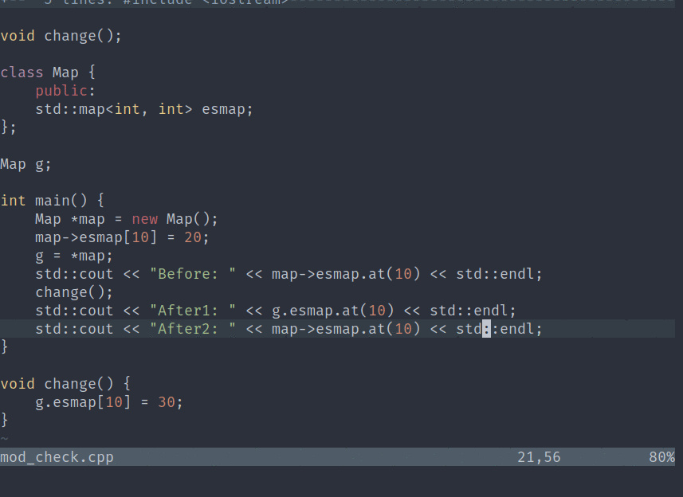

# Vim-AsyncMake

AsyncMake is a simple plugin to utilize the jobs facility introduced in Vim 8, and run shell commands _asynchronously_ from inside Vim.
It has been tweaked specifically to build projects and list out errors, if any.

## Features

* No intrusion to the Vim workflow; works in tandem with quickfix windows and the `errorformat` (details below).
* Falls back to synchronous builds for older Vim versions.

## Usage

AsyncMake tries to be as less intrusive as possible with respect to the default settings.
It can be used in two ways -- (a) on-demand; and (b) behind-the-scenes.

### On-Demand builds


AsyncMake provides a simple command (called, guess what, `AsyncMake`) to run shell commands asynchronously, which can be invoked as follows:
```vim
:AsyncMake [cmd]
```
For example, to compile the current C++ file, use:
```vim
:AsyncMake g++ %
```
Or to compile a certain file `main.cpp`:
```vim
:AsyncMake g++ main.cpp
```

There is also a variable `b:asyncmakeprg`, which could be used to define the default command that needs to be run asynchronously for a buffer.
For example, if you wish to always compile the file in the current buffer, add the following line to `~/.vim/after/ftplugin/c.vim`:
```vim
let b:asyncmakeprg = "g++ %"
```
Next, from a cpp file, type `:AsyncMake` and press `Enter`.

If all the settings worked properly, you would get a `Running: [cmd]` message (it will disappear once the command finishes execution).
If the compilation was successful, you will get a message `No errors!`.
If the compilation failed with some errors, the errors are loaded into the quickfix list, which is opened automatically.
The errors are formatted based on the `errorformat` option for the corresponding compiler. See `:help errorformats` to learn about defining it based on your tastes.

Press `Enter` over an error to jump to it; navigate to the next and previous errors using `:cnext` and `:cprevious`, respectively.
I recommend the following convenience mappings:
```vim
nnoremap ]q :cnext<CR>
nnoremap [q :cprevious<CR>
```
You can close the quickfix window using `:cclose`; it will also be closed automatically if you run `AsyncMake` again and the build is successful.
See `:help quickfix` to learn more about working with quickfix windows.

If your Vim version is below 8 (check using `:version`), the 'Make' part of AsyncMake still works like above; however, the builds will be _synchronous_, that is, you would see the compilation happening as you would normally do by running the command with a `bang`: `:!command`.

### Behind-the-scene builds (Vim 8+)



AsyncMake can also be tweaked to run silently.
Just append a bang (`!`): `AsyncMake!`.
In this mode, AsyncMake will run the specified command (either as an argument or the value of `b:asyncmakeprg`) in the background.
You can view the errors anytime by opening the quickfix window (`:copen`).

In order to run AsyncMake behind-the-scene whenever you write to or open, say, a cpp file, add the following autocommand to your vimrc:
```vim
augroup asyncmake
	autocmd!
	autocmd BufWritePost,BufEnter *.cpp silent! AsyncMake!
augroup END
```

To make behind-the-scene builds more useful, AsyncMake provides a statusline extension.
You can use it as follows:
```vim
set statusline+=%#WarningMsg#%{exists('g:loaded_asyncmake')?asyncmake#statusline():''}%*
```
This function will notify you with the number of errors on your statusline (upon a redraw).
(Note that you need `:set laststatus=2` to always have the statusline visible.)

## Installation

Use your favorite plugin-manager, or install manually.
Refer [this article](https://gist.github.com/manasthakur/ab4cf8d32a28ea38271ac0d07373bb53)
for general help on managing plugins in Vim.

Star this repository on GitHub if you like the plugin.
Use the issue-tracker for complaints and feature-requests.

## License

[MIT](LICENSE)

